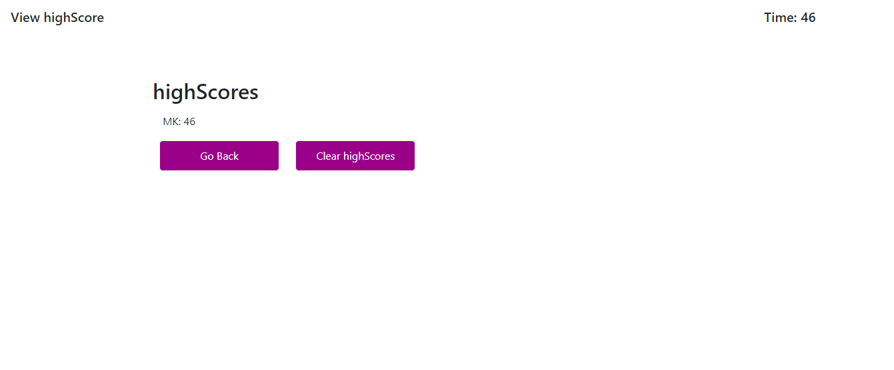
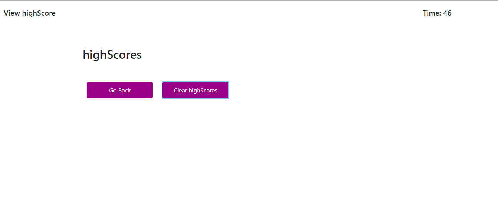

# Web-API-Code-Quiz
 
Title: Code Quiz

Usage/Description:
This assignement  is to allow user to a take a JavaScript code quiz after the click on the Code Quiz button. 

How does this work:
1- When  you lands on the page, they are presented with some instructions about how to take the quiz and what to do avoid penalty.   

2- User will loose 15 sec worth of points if they miss a question.  
3- If they wait too long the time will keep  going and affect their score
4- They should be sent to All done page if the time reaches zero and they try to go to the next page. 
5- Once all done they will be asked to enter thier initial and then will be sent to final page on which they can see their initial and score display
6- There should also be Clear Highscores and Go gack buttons which will respectivelly clear users initial and score and  refresh the page when  clicked. -    

Tool used to build my portfolio site.
1-	Html 
2-	CSS 
3-  Bootstrap
3-	JavaScript 

Credit:
I used the following sites for my  research  during this assignment:
1-google.com
2- https://www.w3schools.com/, stackoverflow.com, bootstrap.com, class recording.    
3-Classmates
4-TA’s and the instructor 

Deploy Link:
https://sile-kiman.github.io/Web-API-Code-Quiz/index.html

Test:
1 -Verify the page’s  look and feel matches the wireframe provided for this assignment- (this maybe slightly different) 
2- Check the other spec such as when you clicks on each button the appropriate actions are performed. 
3-Verify all the pages that were supposed to display are there. 

Image of the Site:

License:
MIT License

Copyright (c) [2019] [Mamessile Kiman]

Permission is hereby granted, free of charge, to any person obtaining a copy
of this software and associated documentation files (the "Software"), to deal
in the Software without restriction, including without limitation the rights
to use, copy, modify, merge, publish, distribute, sublicense, and/or sell
copies of the Software, and to permit persons to whom the Software is
furnished to do so, subject to the following conditions:

The above copyright notice and this permission notice shall be included in all
copies or substantial portions of the Software.

THE SOFTWARE IS PROVIDED "AS IS", WITHOUT WARRANTY OF ANY KIND, EXPRESS OR
IMPLIED, INCLUDING BUT NOT LIMITED TO THE WARRANTIES OF MERCHANTABILITY,
FITNESS FOR A PARTICULAR PURPOSE AND NONINFRINGEMENT. IN NO EVENT SHALL THE
AUTHORS OR COPYRIGHT HOLDERS BE LIABLE FOR ANY CLAIM, DAMAGES OR OTHER
LIABILITY, WHETHER IN AN ACTION OF CONTRACT, TORT OR OTHERWISE, ARISING FROM,
OUT OF OR IN CONNECTION WITH THE SOFTWARE OR THE USE OR OTHER DEALINGS IN THE
SOFTWARE.

